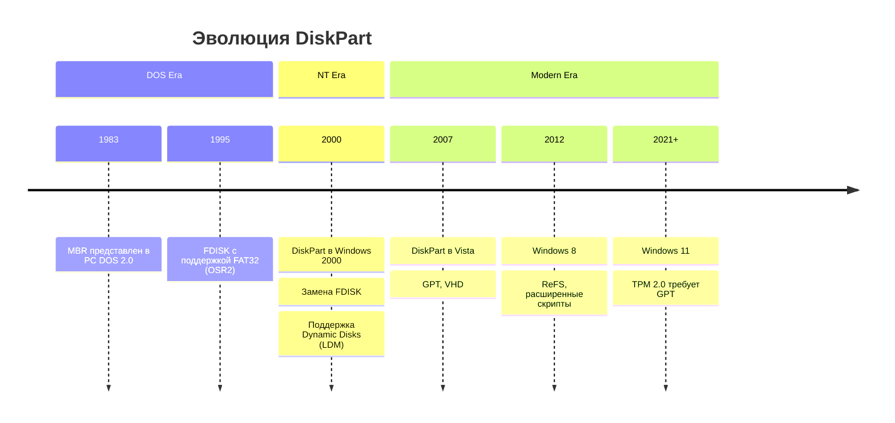
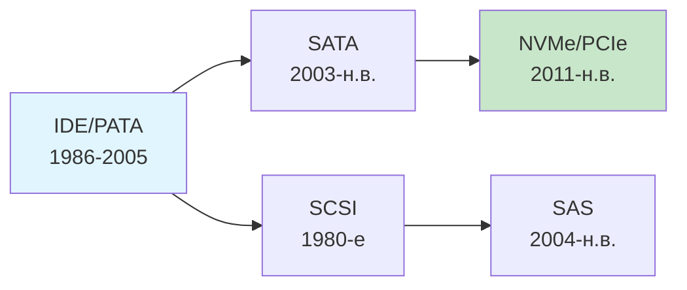

#windows #cli #sysadmin #disk-management #troubleshooting #history #storage 

---

> [!ABSTRACT] Краткое содержание
> **DiskPart** — это текстовая утилита командной строки для управления дисками, разделами и томами в Windows. Введена в Windows 2000 как замена устаревшей `fdisk` . Поддерживает работу с MBR и GPT, скрипты, динамические диски и виртуальные жесткие диски (VHD).

---

## История утилиты и эволюция управления дисками в Windows

### Предшественники: Эра FDISK

До появления DiskPart управление разделами в Windows осуществлялось через утилиту **`fdisk`**, унаследованную от MS-DOS.

| Версия Windows                | Утилита       | Ограничения                                                                                                                                            |
| :---------------------------- | :------------ | :----------------------------------------------------------------------------------------------------------------------------------------------------- |
| **MS-DOS / Windows 95/98/ME** | `fdisk.exe`   | • Не корректно отображает диски >64 ГБ<br>• Максимальный размер раздела — 512 ГБ<br>• Только текстовый интерфейс без скриптов<br>• Работа только с MBR |
| **Windows NT 4.0**            | `fdisk` + GUI | • Ограниченная поддержка динамических дисков<br>• Нет расширенных функций форматирования                                                               |

### Рождение DiskPart (2000)

**DiskPart** была впервые представлена в **Windows 2000** как часть Recovery Console и полноценной ОС .



**Ключевые улучшения DiskPart по сравнению с FDISK:**
- ✅ Поддержка **динамических дисков** (Logical Disk Manager) [[10]]
- ✅ Работа с **GPT** (GUID Partition Table) для дисков >2 ТБ
- ✅ **Скриптовая автоматизация** через параметр `/s`
- ✅ Управление **виртуальными дисками** (VHD/VHDX)
- ✅ Детальный контроль атрибутов (readonly, hidden, nodefaultdriveletter)

> [!NOTE] Интересный факт
> В Recovery Console версий Windows 2000/XP команда `diskpart` имела **урезанный функционал** — только создание/удаление разделов, без возможности установки активного раздела [[7]][[8]].

---

## Эволюция технологий хранения данных

Понимание истории накопителей помогает правильно использовать DiskPart.

### Поколения интерфейсов подключения



| Интерфейс | Период | Макс. скорость | Особенности для DiskPart |
| :--- | :--- | :--- | :--- |
| **IDE (PATA)** | 1986–2005 | 133 МБ/с | Ограничение 137 ГБ без LBA48 |
| **SATA I/II/III** | 2003–н.в. | 6 Гбит/с | Поддержка [[GPT]], горячая замена |
| **SAS** | 2004–н.в. | 12–24 Гбит/с | Enterprise-функции, множественные пути |
| **NVMe** | 2011–н.в. | 32+ Гбит/с | Низкая задержка, требует UEFI+GPT |

### Схемы разметки: MBR vs GPT

DiskPart работает с обеими схемами, но есть критические различия:

| Параметр | [[MBR]] (Master Boot Record) | [[GPT]] (GUID Partition Table) |
| :--- | :--- | :--- |
| **Год появления** | 1983 (PC DOS 2.0) [[21]] | 2000-е (UEFI спецификация) |
| **Макс. размер диска** | 2 ТБ (при 512-байтных секторах) [[18]] | 9.4 ЗБ (теоретически) |
| **Количество разделов** | 4 основных (или 3+1 расширенный) | 128 в Windows (стандарт — неограничен) |
| **Резервирование** | Нет (повреждение MBR = потеря данных) | Копия заголовка в конце диска |
| **Загрузка** | Только BIOS/Legacy | UEFI (рекомендуется для Windows 11) |
| **Команда DiskPart** | `convert mbr` | `convert gpt` |

> [!WARNING] Важное ограничение
> DiskPart **не может** конвертировать диск с MBR на GPT (и наоборот) **без потери данных**. Команда `convert` работает только на **пустом** диске после `clean` [[3]].

---

## 🛠 Практическое применение: сценарии с учётом истории

### Сценарий 1: Восстановление старого диска с MBR

Если вы работаете с устаревшим оборудованием или виртуальной машиной:

```batch
diskpart
list disk
select disk 1
detail disk              :: Проверьте "Тип раздела: MBR"
convert gpt              :: ОШИБКА, если диск не пуст!
clean                    :: ⚠️ Удаляет все данные
convert gpt              :: Теперь работает
create partition efi size=100
format fs=fat32 quick label="System"
create partition primary
format fs=ntfs quick label="Data"
assign letter=D
exit
```

### Сценарий 2: Подготовка NVMe-диска для Windows 11

Современные требования: UEFI + GPT + TPM 2.0

```batch
diskpart
list disk
select disk 0
clean
convert gpt
:: Создаём разделы по спецификации Microsoft
create partition efi size=100
format fs=fat32 quick label="System"
create partition msr size=16
create partition primary
format fs=ntfs quick label="Windows"
assign letter=C
active                   :: Для EFI-загрузки
exit
```

### Сценарий 3: Работа с динамическими дисками (Legacy-функция)

> [!DANGER] Устаревшая технология
> **Динамические диски** (Dynamic Disks) были введены в Windows 2000 [[10]], но Microsoft рекомендует использовать [[Storage Spaces]] в современных версиях.

```batch
diskpart
list disk
select disk 1
convert dynamic          :: Преобразует базовый диск в динамический
create volume raid size=10000 disk=1,2  :: Требует минимум 2 диска
assign letter=R
exit
```

---

## Автоматизация и скрипты

### Пример скрипта для массового развёртывания

Файл `prepare-storage.txt`:
```text
rem === Скрипт подготовки диска для деплоя ===
rem Требует запуска от администратора

list disk
select disk %TARGET_DISK%
clean
convert gpt

rem EFI System Partition
create partition efi size=100
format fs=fat32 quick label="ESP"

rem Microsoft Reserved
create partition msr size=16

rem Основной раздел Windows
create partition primary
format fs=ntfs quick label="OS"
assign letter=C

rem Раздел восстановления
create partition primary size=500
format fs=ntfs quick label="Recovery"
set id="de94bba4-06d1-4d40-a16a-bfd50179d6ac"
gpt attributes=0x8000000000000001

exit
```

Запуск:
```batch
diskpart /s "C:\scripts\prepare-storage.txt" /log "C:\logs\diskprep_%COMPUTERNAME%.txt"
```

> [!TIP] Переменные окружения
> В скриптах DiskPart **не поддерживаются** переменные `%VAR%`. Используйте PowerShell для предварительной подстановки значений или генерацию скрипта на лету.

---

## Совместимость и ограничения по версиям Windows

| Версия Windows | Поддержка DiskPart | Особенности |
| :--- | :--- | :--- |
| **Windows 2000/XP** | ✅ Базовая | Нет поддержки GPT, только MBR |
| **Windows Vista/7** | ✅ Расширенная | Появилась поддержка GPT, VHD |
| **Windows 8/8.1** | ✅ Полная | Поддержка ReFS, улучшенные скрипты |
| **Windows 10** | ✅ Полная + VHD/VHDX | Интеграция с WSL, контейнерами |
| **Windows 11** | ✅ Полная + требования UEFI | GPT обязателен для установки [[24]] |
| **Windows Server** | ✅ Все функции | Поддержка кластеров, Storage Spaces |

> [!NOTE] ReactOS
> DiskPart также реализован в открытой ОС **ReactOS** под лицензией GPLv2, что позволяет изучать исходный код утилиты.

---

## Диагностика и устранение неполадок

### Частые ошибки с историческим контекстом

| Ошибка                                         | Историческая причина                       | Современное решение                                                  |
| :--------------------------------------------- | :----------------------------------------- | :------------------------------------------------------------------- |
| `The selected disk is not fixed`               | DiskPart изначально проектировался для HDD | Используйте `attributes disk clear readonly` для съёмных носителей   |
| `Virtual Disk Service error`                   | Служба VDS появилась в Windows 2003        | Запустите `net start vds` или проверите зависимости                  |
| `The media is write protected`                 | Аппаратная защита флешек + реестр          | Проверьте переключатель на корпусе; `attributes disk clear readonly` |
| `Cannot partition a GPT disk on a BIOS system` | Legacy BIOS не понимает GPT                | Переключите firmware на UEFI или используйте MBR (`convert mbr`)     |
