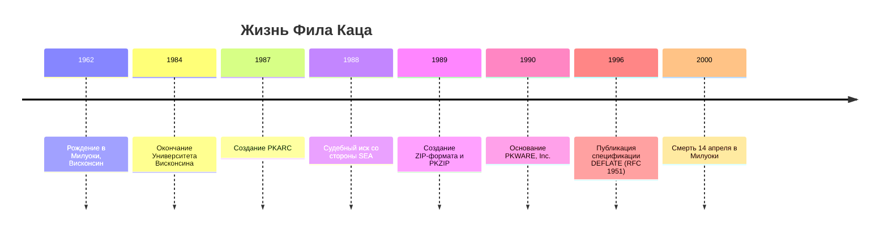

> [!quote] Имя, навсегда связанное с каждым `.zip`-файлом в мире
> **Филлип Уолтер Кац** (англ. *Phillip Walter Katz*) — американский программист, создатель формата **ZIP** и утилиты **PKZIP**, изменивший навсегда способ обмена и хранения цифровой информации.

---

## 🧬 Ранние годы и образование

Филлип Уолтер Кац родился **3 ноября 1962 года** в городе **Милуоки**, штат Висконсин, США. С раннего детства Фил проявлял необычайный интерес к вычислительной технике и электронике — в то время, когда персональные компьютеры были редкостью и увлечением единиц. Его родители, Мэри и Джеральд Кац, замечали у сына аналитический склад ума и упорство в решении технических задач, которые далеко выходили за рамки школьной программы.

![[Pasted image 20260427105959.png]]

После окончания средней школы Фил поступил в **Университет Висконсина в Милуоки** (University of Wisconsin–Milwaukee), где избрал специальность «Компьютерные науки» (Computer Science). В университете он зарекомендовал себя как один из самых одарённых студентов курса — преподаватели отмечали его способность глубоко понимать алгоритмы и писать исключительно эффективный код. В 1984 году Кац получил степень **бакалавра компьютерных наук**, и перед ним открылся мир профессионального программирования.

---

## 💼 Начало карьеры

После окончания университета Фил Кац устроился на работу в компанию **Allen-Bradley** (позже приобретённую Rockwell Automation), крупного производителя промышленной автоматики, расположенную в Милуоки. Его обязанностями была разработка программного обеспечения для промышленных контроллеров и встраиваемых систем. Эта работа позволила ему глубоко погрузиться в мир низкоуровневого программирования и оптимизации кода — навыки, которые впоследствии окажутся критически важными при создании алгоритмов сжатия данных.

Параллельно с основной работой Кац увлекался **BBS** (Bulletin Board Systems) — электронными досками объявлений, которые в 1980-е годы были основным средством коммуникации в компьютерном сообществе. Именно в среде BBS зародилась потребность в эффективном сжатии файлов: пользователи делились программами, документами и играми, а модемные соединения того времени были крайне медленными. Каждый лишний байт в файле означал дополнительные минуты (а иногда и часы) ожидания при передаче.

---

## ⚡ Рождение PKZIP и формата ZIP

### Предыстория: ARC и SEA

В середине 1980-х годов стандартом сжатия данных была утилита **ARC**, созданная Томасом Хендриксом (Thom Henderson) из компании **System Enhancement Associates** (SEA). ARC объединяла несколько файлов в один архив и сжимала их с помощью алгоритма, основанного на работе Лемпеля-Зива. Программа была коммерческой — за неё нужно было платить, и это раздражало многих пользователей BBS.

### PKARC: Вызов гиганту

В 1987 году Фил Кац, работая дома в свободное время, создал программу **PKARC** — совместимую с ARC альтернативу, которая работала **значительно быстрее** оригинала. Кац переосмыслил алгоритмы сжатия и переписал код с нуля на языке ассемблера, добившись впечатляющего прироста производительности. PKARC распространялся как **shareware** — пользователи могли бесплатно попробовать программу и оплатить её при регулярном использовании. Это делало PKARC невероятно популярной в сообществе BBS.

Успех PKARC не остался незамеченным. В январе 1988 года компания **SEA** подала на Фила Каца иск за нарушение авторских прав, утверждая, что PKARC содержал код, скопированный из ARC. Начался один из самых известных судебных процессов в истории программного обеспечения.

### Судебная битва

> [!warning] Суть конфликта
> SEA обвинила Каца в том, что он декомпилировал ARC и использовал фрагменты исходного кода в PKARC. Кац отрицал это, утверждая, что лишь изучил *формат файлов* ARC (который не был запатентован) и написал собственную реализацию с нуля.

Судебный процесс продолжался большую часть 1988 года. В конечном итоге стороны достигли **внесудебного соглашения**: Кац признал, что использовал исходный код SEA в ранних версиях PKARC, и обязался прекратить его распространение. Также он выплатил SEA undisclosed сумму в качестве компенсации. Для молодого программиста это был тяжёлый удар — как финансовый, так и репутационный.

### PKZIP: Триумф из пепла

Вместо того чтобы сдаться, Фил Кац пошёл другим путём. Он разработал **полностью новый формат архивации** и новую утилиту для работы с ним. Так в **1989 году** появились формат **ZIP** и программа **PKZIP**.

> [!note] Ключевое новшество ZIP
> ZIP-формат использовал алгоритм сжатия **DEFLATE**, созданный **Филом Кацем** совместно с другими авторами. DEFLATE сочетал алгоритм Лемпеля-Зива-Велча (LZ77) и кодирование Хаффмана, обеспечивая превосходное соотношение степени сжатия и скорости. Формат ZIP был открыт — любая программа могла создавать и читать ZIP-файлы без лицензионных отчислений.

PKZIP стала **феноменальным успехом**. Программа:
- работала **намного быстрее** любых конкурентов;
- обеспечивала **лучшую степень сжатия**;
- была **надёжной** и не портила данные;
- распространялась как **shareware** по доступной цене.

К 1990 году PKZIP стала стандартом де-факто для сжатия файлов в мире DOS и Windows. Миллионы пользователей по всему миру использовали PKZIP ежедневно, и имя «Фил Кац» стало синонимом сжатия данных.

---

## 🏢 Основание PKWARE

В **1990 году** Фил Кац основал компанию **PKWARE, Inc.**, зарегистрированную в Милуоки, штат Висконсин. Компания занималась разработкой и распространением программного обеспечения для сжатия данных. Основные продукты включали:

| Продукт | Описание | Год выпуска |
|---------|----------|-------------|
| **PKZIP** | Флагманская утилита для создания ZIP-архивов | 1989 |
| **PKUNZIP** | Утилита для распаковки ZIP-архивов | 1989 |
| **PKZIP for Windows** | Версия PKZIP с графическим интерфейсом для Windows | 1993 |
| **PKZIP for UNIX** | Портирование PKZIP на платформу UNIX | 1993 |

PKWARE быстро выросла из компании-одиночки в полноценную организацию с десятками сотрудников. В то же время ZIP-формат получил широкое распространение — его поддерживали другие программы, такие как **WinZip**, **Nico Mak Computing** и многие другие. Формат стал частью десятков операционных систем и программных платформ.

> [!important] ZIP стал стандартом
> К середине 1990-х годов ZIP был выбран как встроенный формат сжатия в операционных системах Windows (начиная с Windows Me), macOS, Linux и множества других платформ. Сегодня файлы `.zip` — один из самых распространённых форматов в мире, и это наследие — целиком заслуга Фила Каца.

---

## 🏛️ Техническое наследие

### Алгоритм DEFLATE

Фил Кац был соавтором спецификации алгоритма **DEFLATE** (RFC 1951), опубликованной в **мае 1996 года**. DEFLATE стал одним из наиболее широко используемых алгоритмов сжатия без потерь в истории. На его основе работают:

- Формат **ZIP** (RFC 1950)
- Формат **gzip** (RFC 1952)
- Формат изображений **PNG**
- Протокол **HTTP** (сжатие `Content-Encoding: deflate`)
- Библиотека **zlib**, используемая в миллионах программ

### ZIP-формат (PKZIP APPNOTE)

Спецификация ZIP-формата была опубликована Кацем как открытый документ, известный как **APPNOTE**. Это решение было стратегически важным: открытость формата позволила другим разработчикам создавать совместимые программы, что привело к повсеместному принятию ZIP как отраслевого стандарта.

### Долгосрочное влияние

Наследие Фила Каца продолжает жить в каждом `.zip`-файле, каждом `.gz`-архиве и каждом `.png`-изображении. Алгоритмы, которые он помог создать, ежедневно используются миллиардами людей по всему миру, чаще всего без осознания того, чьим трудом они обязаны этой технологией.

---

## 📅 Хронология жизни

---

## 💔 Личная жизнь и трудности

Несмотря на профессиональный триумф, личная жизнь Фила Каца была отмечена серьёзными трудностями. Судебный процесс с SEA в 1988 году нанёс ему глубокую психологическую травму. Коллеги и друзья вспоминали, что после суда Фил стал более замкнутым и подозрительным.

С начала 1990-х годов Кац начал активно злоупотреблять **алкоголем**. Эта проблема постепенно усугублялась, оказывая разрушительное влияние на его здоровье, деловые отношения и личную жизнь. В последние годы он несколько раз проходил курс лечения от алкогольной зависимости, но ремиссии были недолгими.

> [!quote] Слова знакомых
> Фил был блестящим программистом, но он был одиноким человеком. Он жил в мире кода и алгоритмов, и реальный мир часто казался ему слишком жестоким.

К концу 1990-х годов здоровье Фила серьёзно ухудшилось. Он похудел, стал неряшливым и всё реже появлялся в офисе PKWARE. Компания переживала финансовые трудности, а сам Кац отдалился от дел управления.

---

## ⚰️ Смерть и наследие

**14 апреля 2000 года** Фил Кац был найден мёртвым в своей квартире в Милуоки. По данным полиции, причиной смерти стала острая **панкреатическая интоксикация**, вызванная хроническим алкоголизмом. Ему было **37 лет**.

Его тело было обнаружено лишь через несколько дней после смерти — печливое свидетельство его одиночества. В квартире нашли пустые бутылки из-под алкогольных напитков. Заметка от сотрудников отеля, где он останавливался в последние дни, гласила, что он выглядел «extremely pale and gaunt» (чрезвычайно бледным и истощённым).

---

## 🌟 Значение для индустрии

> [!abstract] Итоги наследия Фила Каца
>
> 1. **ZIP-формат** — самый распространённый формат сжатия файлов в мире
> 2. **Алгоритм DEFLATE** — основа для gzip, PNG, zlib и многих других технологий
> 3. **Открытая спецификация** — подход, который предвосхитил движение за открытое ПО
> 4. **Shareware-модель** — PKZIP стала одной из первых программ, доказавших коммерческую жизнеспособность shareware

Фил Кац никогда не получил того признания при жизни, которого заслуживал. Он не был публичной фигурой, не выступал на конференциях и не давал интервью. Но его творение — ZIP-формат — окружает нас каждый день. Каждый раз, когда вы скачиваете архив, распаковываете файл или загружаете изображение в формате PNG, вы пользуетесь наследием Фила Каца.